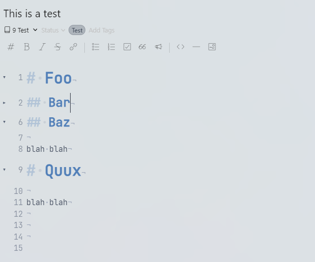

# Code fold

Lets you fold and unfold text blocks in the editor.

## Shortcuts

| Command                | Shortcut                                             | Description |
| ---------------------- | ---------------------------------------------------- | ----------- |
| `code-fold:fold-all`   | <kbd>Control</kbd> + <kbd>Shift</kbd> + <kbd>E</kbd> | Fold all    |
| `code-fold:unfold-all` | <kbd>Control</kbd> + <kbd>Shift</kbd> + <kbd>R</kbd> | Unfold all  |

## Example

## Changelog

See the [GitHub releases](https://github.com/Keisir/inkdrop-code-fold/releases) for an overview of what changed in each update.

## Acknowledgements

Thanks to @moyicat for creating this plugin.
